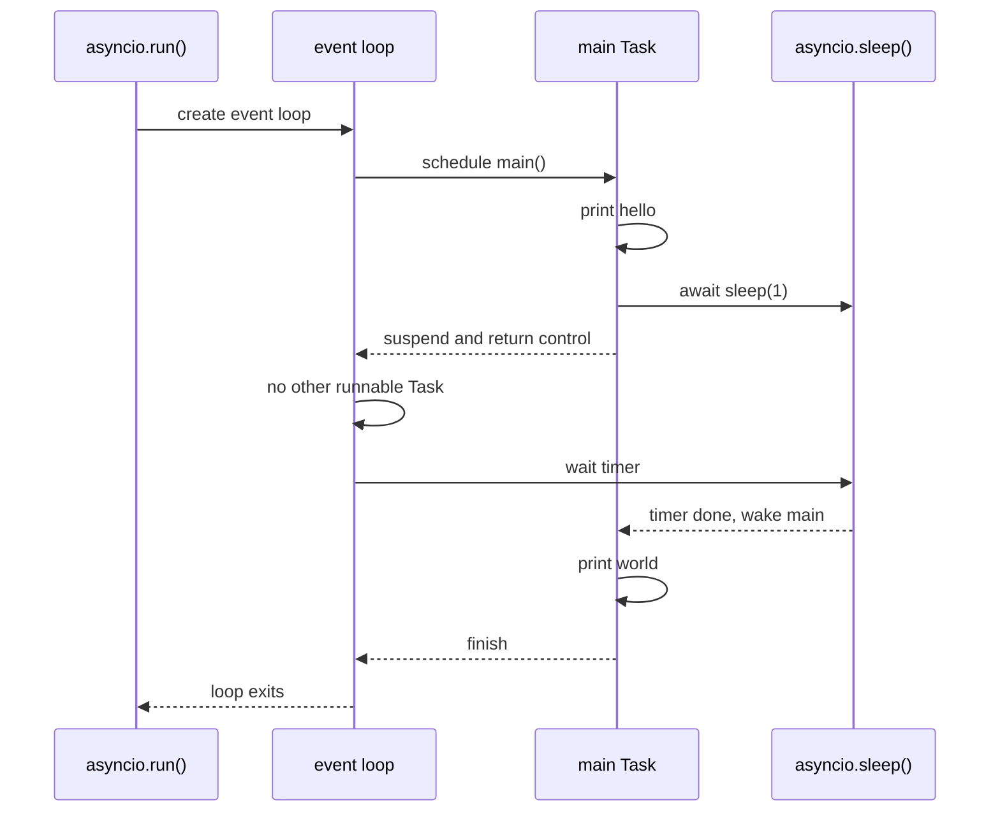
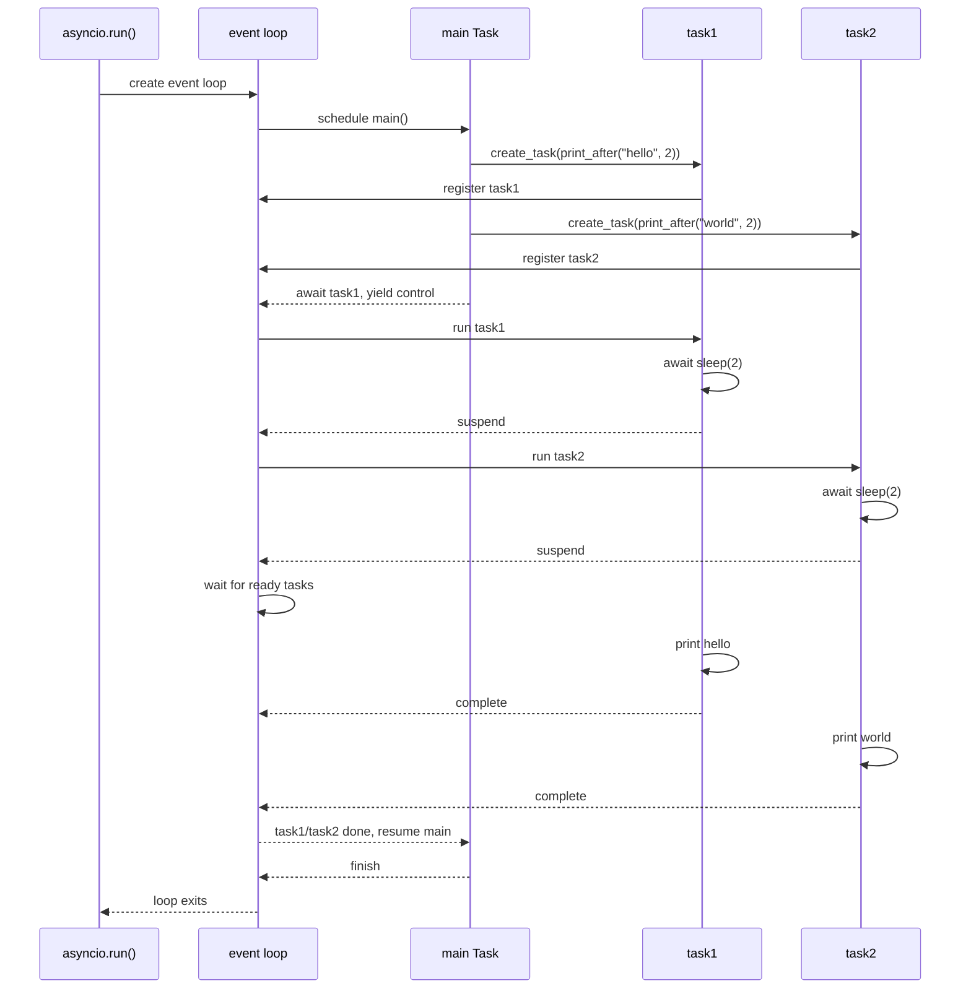

# Asyncio 入门

Asyncio 入门学习笔记

## 引入

### Coroutine Function

正如C#，python也通过 `async` 和 `await` 来编写异步代码。  
一个 `async def` 的函数就是一个 `coroutine function`，而这样一个函数会返回一个 `coroutine object`，同时，我们可以在 `async def` 的函数内部使用 `await` 来等待其余可等待对象，例如如下代码。

```python
import asyncio

async def main():
    print('hello')
    await asyncio.sleep(1) # await 一个 coroutine object
    print('world')

coro = main()
```

```python
>>> coro
<coroutine object main at 0x000001BC0902AC80>
```

### Event Loop

在上述代码中只定义了一个 `coroutine function`，但是没有运行起来。  
我们需要用 `asyncio.run(coro, *, debug=None, loop_factory=None)` 方法来运行。

```python
asyncio.run(main()) # 等价于 asyncio.run(coro)
```

??? note "asyncio.run() 背后细节"
    这一步会干很多事情，其中最重要的是，由于这里 `loop_factory` 参数为 `None`，故我们会调用 `asyncio.new_event_loop()` 来创建一个 `event loop`，然后 `main()` 会被包装成一个 `Task`，而 `Task` 正是 `event loop` 中最小的可调度单元，`event loop` 检测到有这样一个任务可以执行，便开始执行它。  
    `event loop` 是一个异步程序的调度中心，理想情况下，应该只有一个 `event loop`，也就是应该**只调用一次** `asyncio.run`。

在 `main()` 这个 `coroutine function` 内部，我们正常执行打印hello，然后遇到了 `await`，`main` 被阻塞，等待一秒后，`asyncio.sleep()` 结束了，`main()` 继续执行，且可以拿到 `asyncio.sleep()` 的返回值（当然这里没有返回值），然后再打印world，最后退出。

??? note "await 背后发生了什么"
    这里，`await` 后面跟一个 `coroutine object`，`main()` 就会等待 `asyncio.sleep` 的完成，即挂起，同时会把控制权交还给 `event loop`。当然，粗略的来看，这里交出去没什么用，毕竟 `event loop`里面还是只有 `main` 这一个 `Task`。  
    换言之，这里 `await` 并没有创建一个新的 `Task`，而是通过调用 `coroutine object` 的 `__wait__()` 方法获得一个迭代器，python会不断驱动这个迭代器。同时，在这个方法里，我们会绑定一个回调函数，它将在 `coroutine object` 完成（事实上，就是迭代器raise一个 `StopIteration`）后，唤醒 `main`，`main` 获得 `coroutine object` 的返回值并重新拿回控制权。然后再执行后面的代码。

下面这张图可以把没有 `Task` 的调度过程画得更直观一些：



## 异步demo

### 看似异步实则同步

我们来看这样一段代码

```python
import asyncio
import time

async def print_after(content, second):
    await asyncio.sleep(second)
    print(content)

async def main():
    print(f"started at {time.strftime("%X")}")

    await print_after("hello", 2)
    await print_after("world", 2)

    print(f"ended at {time.strftime("%X")}")

asyncio.run(main())
```

运行我们会发现，实际上这段代码用了4s，原因很简单，我们一直在 `await` 别的任务完成，而等待第一个 `print_after` 的时候，我们可以让第二个 `print_after` 一起等待，然而我们的代码要求必须等待完第一个才能等待第二个，这不是我们的初衷。

### 使用Task

不能异步的本质原因是，在我们 `main()` 等待的时候，我们的 `event loop` 里面只有一个 `main`，我们只能等待它。而如果我们提前将要等待的 `coroutine object` 包装成一个 `Task`，提前塞进 `event loop`，这样在等待的时候我们就可以执行别的任务了。

```python
import asyncio
import time

async def print_after(content, second):
    await asyncio.sleep(second)
    print(content)

async def main():
    print(f"started at {time.strftime("%X")}")

    task1 = asyncio.create_task(print_after("hello", 2))
    task2 = asyncio.create_task(print_after("world", 2))

    await task1
    await task2

    print(f"ended at {time.strftime("%X")}")

asyncio.run(main())
```

这次运行我们会发现只用了2s，这就是最基本的异步使用方式。

??? note "await的时候有什么变化"
    首先，我们这里 `await` 的不再是 `coroutine object`，而是 `Task`。当然这些都是 awaitable 的，事实上 `Task` 继承自 `Future`，`Future` 也是 awaitable 的。  
    这里我们在 `main()` 里创建了两个 `Task`，并将其注册到了 `event loop` 里面。这样一来，当 `main` 遇到 `await` 并把控制权交还的时候，`event loop` 就会发现这里还有两个 `Task` 可以执行，于是它就让它们执行起来，实现了异步。  

这里与我们初版代码最大的不同在于，通过 `Task`，我们在第一次 `await` 的时候可以让两个方法同时执行。

下面这张图展示了引入 `Task` 之后，`event loop` 的调度流程：



一个自然的问题是，如果我要创建很多 `Task`，难道需要一个个手动写吗。  
使用 `asyncio.gather(*aws, return_exceptions=False)` 方法来并发运行 `aws` 序列中的可等待对象。  
并且，如果 `aws` 序列中的某个对象为 `coroutine object`，那么它会被自动转为一个 `Task`，也就是说调用 `asyncio.gather()` 时不必使用 `asyncio.create_task()`。该方法也会返回一个可等待对象，特别的，如果 `await` 来获取放回值，将得到各个返回值组成的 `list`。

那么上述代码可以化简为

```python
import asyncio
import time

async def print_after(content, second):
    await asyncio.sleep(second)
    print(content)

async def main():
    print(f"started at {time.strftime("%X")}")

    await asyncio.gather(print_after("hello", 2), print_after("world", 2))

    print(f"ended at {time.strftime("%X")}")

asyncio.run(main())
```

### 在线程中运行

```python
asyncio.to_thread(func, /, *args, **kwargs)
```

在不同的线程中异步地运行函数 `func`。这个的主要作用是执行在其他情况下会阻塞事件循环的 IO 密集型函数/方法。

我们看python官方文档的一个例子

```python
def blocking_io():
    print(f"start blocking_io at {time.strftime('%X')}")
    # 请注意 time.sleep() 可被替换为任意一种
    # 阻塞式 IO 密集型操作，例如文件操作。
    time.sleep(1)
    print(f"blocking_io complete at {time.strftime('%X')}")

async def main():
    print(f"started main at {time.strftime('%X')}")

    await asyncio.gather(
        asyncio.to_thread(blocking_io),
        asyncio.sleep(1))

    print(f"finished main at {time.strftime('%X')}")


asyncio.run(main())
```

这里将 `blocking_io` 放到了不同的线程中执行，否则，在 `time.sleep()` 的时候，我们的 `asyncio.sleep()` 不能执行，会导致导致额外的 1 秒运行时间。因此我们在单独的线程中运行它从而不阻塞事件循环。

## 同步原语

### Lock

> 互斥锁保证同一时刻只有一个协程可以执行被保护的代码块。  
> asyncio 锁可被用来保证对共享资源的独占访问。

??? warning "与线程锁区别"
    要注意这里不是线程之间资源竞争，不能误写成`threading.lock()`，而且这里的 `lock` 本身也是非线程安全的。

推荐的实践方式是使用 `async with`，这相当于做了

```python
await lock.acquire()
try:
    # 访问共享状态
finally:
    lock.release()
```

例如：

```python
import asyncio
import time

async def worker(lock, name):
    async with lock:
        print(f"{name} acquire lock at {time.strftime('%X')}")
        await asyncio.sleep(1)
        print(f"{name} release lock at {time.strftime('%X')}")

async def main():
    lock = asyncio.Lock()
    await asyncio.gather(worker(lock, "A"), worker(lock, "B"))

asyncio.run(main())
```

### Event

> `asyncio.Event` 可被用来通知多个 asyncio 任务已经有事件发生。  
> `Event` 对象会管理一个内部旗标，可通过 `set()` 方法将其设为 true 并通过 `clear()` 方法将其重设为 false。 `wait()` 方法会阻塞直至该旗标被设为 true。该旗标初始时会被设为 false.

示例

```python
async def waiter(event):
    print('waiting for it ...')
    await event.wait()
    print('... got it!')

async def main():
    event = asyncio.Event()

    # 产生一个任务等待直到 'event' 被设置。
    waiter_task = asyncio.create_task(waiter(event))

    await asyncio.sleep(1)
    # 设置 `event`
    event.set()

    await waiter_task

asyncio.run(main())
```

### Condition

> `asyncio.Condition` 可被任务用于等待某个事件发生，然后获取对共享资源的独占访问。  
> 在本质上，`Condition` 对象合并了 `Event` 和 `Lock` 的功能。多个 `Condition` 对象有可能共享一个 `Lock`，这允许关注于共享资源的特定状态的不同任务实现对共享资源的协同独占访问。

`Condition` 最常见的应用场景就是生产者消费者模型。

```python
import asyncio

async def consumer(cond, queue):
    async with cond:
        while not queue:
            await cond.wait()
        item = queue.pop(0)
        print(f"Consume: {item}")

async def producer(cond, queue):
    for i in range(3):
        await asyncio.sleep(1)
        async with cond:
            queue.append(i)
            print(f"Produce: {i}")
            cond.notify()

async def main():
    cond = asyncio.Condition()
    queue = []
    await asyncio.gather(consumer(cond, queue), producer(cond, queue))

asyncio.run(main())
```

### Semaphore

> `asyncio.Semaphore` 会管理一个内部计数器，该计数器会随每次 `acquire()` 调用递减并随每次 `release()` 调用递增。 计数器的值永远不会降到零以下；当 `acquire()` 发现其值为零时，它将保持阻塞直到有某个任务调用了 `release()`。

构造函数 `asyncio.Semaphore(value=1)` 可指定计数器初值。

常用于限制同时执行的最大协程数量。

### Queue

`asyncio.Queue` 是 asyncio 中用于协程之间安全传递数据的先进先出队列。

```python
class asyncio.Queue(maxsize=0)
```

> 如果 `maxsize` 小于或等于零，则队列大小是无限的。  
> 如果它是一个大于 0 的整数，则当队列达到 `maxsize` 时，`await put()` 会阻塞，直到通过 `get()` 移除一个项目。

在 `asyncio.Queue` 内部会有一个计数器，用来统计未完成任务的数量。它与 `join()` 和 `task_done()` 息息相关。

> 当条目添加到队列的时候，未完成任务的计数就会增加。每当消费协程调用 `task_done()` 表示这个条目已经被回收，该条目所有工作已经完成，未完成计数就会减少。当未完成计数降到零的时候， `join()` 阻塞被解除。  
> 对于每个被用于获取工作条目的 `get()`，将有一个对 `task_done()` 的后续调用来告诉队列该工作条目的操作已完成。  
> 如果 `join()` 当前正在阻塞，在所有条目都被处理后，将解除阻塞 (意味着每个 `put()` 进队列的条目的 `task_done()` 都被收到)。

示例：

```python
import asyncio
import random
import time

async def worker(name, queue):
    while True:
        # Get a "work item" out of the queue.
        sleep_for = await queue.get()

        # Sleep for the "sleep_for" seconds.
        await asyncio.sleep(sleep_for)

        # Notify the queue that the "work item" has been processed.
        queue.task_done()

        print(f'{name} has slept for {sleep_for:.2f} seconds')

async def main():
    # Create a queue that we will use to store our "workload".
    queue = asyncio.Queue()

    # Generate random timings and put them into the queue.
    total_sleep_time = 0
    for _ in range(20):
        sleep_for = random.uniform(0.05, 1.0)
        total_sleep_time += sleep_for
        queue.put_nowait(sleep_for) # 这里显然我们不需要异步，故不必使用 await queue.put()，使用同步版本即可。

    # Create three worker tasks to process the queue concurrently.
    tasks = []
    for i in range(3):
        task = asyncio.create_task(worker(f'worker-{i}', queue))
        tasks.append(task)

    started_at = time.monotonic()
    # Wait until the queue is fully processed.
    await queue.join()
    total_slept_for = time.monotonic() - started_at

    # Cancel our worker tasks.
    for task in tasks:
        task.cancel()
    # Wait until all worker tasks are cancelled.
    await asyncio.gather(*tasks, return_exceptions=True)

    print('====')
    print(f'3 workers slept in parallel for {total_slept_for:.2f} seconds')
    print(f'total expected sleep time: {total_sleep_time:.2f} seconds')

asyncio.run(main())
```

## 异步迭代器

异步迭代器必须实现`aiter`和`anext`方法。`anext`方法会返回一个可等待对象，`async for`可用于遍历异步迭代器。

示例：

```python
class AsyncIterable:
    def __aiter__(self):
        return self

    async def __anext__(self):
        data = await self.fetch_data()
        if data:
            return data
        else:
            raise StopAsyncIteration

    async def fetch_data(self):
        ...

async for TARGET in ITER:
    BLOCK
else:
    BLOCK2
```
