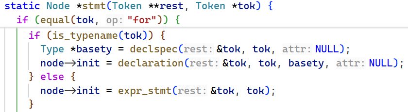
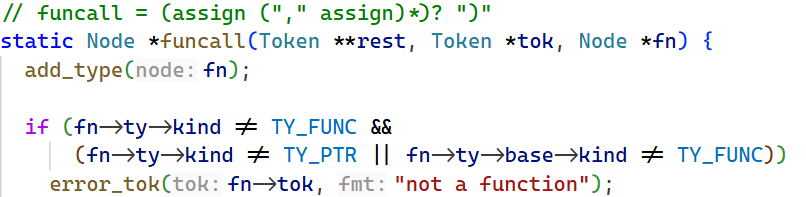
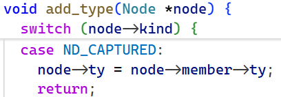

# Closure

> 上回: [Variable Capture](./variable_capture.md)

## 词法分析

### 解析闭包类型

#### 新增closure_type

我们新增闭包类型 `lambda <return-type> (<params>)`，一个闭包类型的变量实际包含两个指针 `fn` 和 `env`，其中 `fn` 指向编译器生成的全局 `lambda` 函数，而 `env` 指向创建该 `lambda` 时在栈上分配的捕获环境块。我们用一个结构体来包裹这两个变量。  

```c
static Type *new_closure_type(Type *ty) {
  Type *closure = struct_type();

  Member *fn = calloc(1, sizeof(Member));
  fn->ty = pointer_to(ty_void);
  fn->offset = 0;
  fn->align = 8;

  Member *env = calloc(1, sizeof(Member));
  env->ty = pointer_to(ty_void);
  env->offset = 8;
  env->align = 8;

  fn->next = env;
  closure->members = fn;
  closure->size = 16;
  closure->align = 8;
  closure->return_ty = ty->return_ty;
  closure->params = ty->params;
  closure->is_variadic = ty->is_variadic;
  return closure;
}
```

然后，我们在 `declspec` 函数中处理闭包类型的解析。这里其实只需要跳过 `lambda` token，后面的解析逻辑与之前 `parse` 函数中的一致。

```c
static Type *declspec(Token **rest, Token *tok, VarAttr *attr) {
  if (equal(tok, "lambda")) {
    tok = tok->next;
    Type *basety = declspec(&tok, tok, NULL);
    Type *ty = func_params(&tok, skip(tok, "("), basety);
    *rest = tok;
    return new_closure_type(ty);
  }
  // ...
}
```

#### AST Node ND_CLOSURE

另外，我们再添加一种AST节点 `ND_CLOSURE` 到 `chibicc.h`，并在 `Node` 中添加闭包类型需要的属性。

我们对该 `Node` 的设计如下：

1. 用 `var` 来存储编译期的 `fn`
2. 添加 `env_size` 来记录 `env` 的大小
3. 添加 `captures` 来记录哪些变量被捕获（具体类型详见后文）
4. 添加 `closure_slot` 来作为槽位，便于后续保存运行期 `fn` 和 `env` 的地址。

当然，别忘了对 `type.c` 的 `add_type()` 函数增加对 `ND_CLOSURE` 类型的处理。

~~实际上直接return就行，因为 `ND_CLOSURE` 类型的 `node` 在创建时就已经设置好 `type`~~

#### 添加到typename

然而，这时如果运行测试，会发现解析仍会报错 "parameter name omitted"。原因是 `lambda <return-type> (<params>)` 开头的语句，既可能是声明一个闭包，也可能是声明一个函数，而后者要求参数有名字。在 `stmt` 函数中，解析器用 `is_typename` 来决定我们是将其当作变量声明还是表达式：如果不把 `lambda` 当作类型名，语句就会走 `stmt() → expr_stmt() → primary()` 的 lambda 表达式分支，但我们希望它走声明分支。因此需要把 `lambda` 注册为关键字，使 `is_typename` 返回真，从而走 `declspec` 来解析变量。



### 支持调用闭包

此时运行测试，看到闭包类型被正确解析，然而会有报错 "not a function"，也就是不支持调用我们的闭包。我们定位到抛出该错误的函数



我们需要修改判断条件，使得闭包可以被调用。然而我们的闭包本质上是个 struct，所以需要额外给 `Type` 添加一个 `is_lambda` 字段，并在之前解析闭包类型时将该属性设为 `true`。  
关于条件判断：调用方可能是个函数，也可能是函数指针，还可能是个闭包。我们先脱去指针，再判断是否为闭包。  

```c
Type *base = (fn->ty->kind == TY_PTR) ? fn->ty->base : fn->ty;
bool is_closure = base->kind == TY_STRUCT && base->is_lambda;
```

??? warning "为什么要判断是否为指针而非判断是否为函数？"
    原代码判断 `fn->ty->kind == TY_FUNC`，是可行的，因为不是函数就是指针，然而我们这种情况不行。  
    因为我们除了指针，还有闭包类型。而由于我们闭包设置时已经将 `return_ty` 和 `params` 等属性指定好，这意味着闭包是可以执行的。  
    因此闭包和函数可以直接执行，而指针不能，所以特判指针即可。

随后修改判断条件，加上对 `is_closure` 的判断即可。  

### 变量按值捕获

这里我们要做的工作有

1. 确认某个变量是否要捕获
2. 捕获该变量：需要记录原变量是什么、变量的类型，以及计算它在 `env` 中的偏移量。

这里我们需要区分普通变量和被捕获的变量，因为在代码生成阶段，后者实际使用地址为 `env + offset`，因此我们要对被捕获变量做标记。

#### AST Node ND_CAPTURED

我们在 `chibicc.h` 中新增一种 `AST node` 名为 `ND_CAPTURED`。  

这里我们需要考虑一下这种 `node` 的设计。使用这种 `node` 时，我们先获取 `env` 的地址，再根据成员 `member` 中的 `offset` 计算出被捕获变量的实际地址。这一过程恰好与 C 语言中结构体成员的访问方式一致，我们看看 `chibicc` 中的实现：

```c
//codegen.c

case ND_MEMBER:
  gen_addr(node->lhs);                                 // %rax = 结构体基址
  println("  add $%d, %%rax", node->member->offset);   // 基址 + 成员偏移
```

其中 `gen_addr(node->lhs)` 是取结构体的基址，其核心代码为

```c
static void gen_addr(Node *node) {
  switch (node->kind) {
  case ND_VAR:
    // Variable-length array, which is always local.
    if (node->var->ty->kind == TY_VLA) {
      println("  mov %d(%%rbp), %%rax", node->var->offset); // node->var->offset得到相对帧基址的偏移量
      return;
    }
    // ...
  }
  // ...
}
```

这启发我们，我们可以将 `ND_CAPTURED` 的 `node->var` 用来存储 `env`，`node->member` 存储实际捕获的变量的类型和偏移量。当然，该 `node` 本身的类型应当与被捕获变量以及 `node->member->ty` 保持一致。

我们来编写 `new_captured_node` 函数（这里的 `ctx` 变量会在后文解释，我们知道它携带 `env` 字段即可）

```c
static Node *new_captured_node(LambdaCtx *ctx, Member *member, Token *tok) {
  Node *node = new_node(ND_CAPTURED, tok);
  node->var = ctx->env;
  node->member = member;
  node->ty = member->ty; // 标注类型
  return node;
}
```

同时，别忘了在 `type.c` 的 `add_type` 函数中增加对 `ND_CAPTURED` 类型的处理。



#### 设计数据结构

之后，我们来考虑实际的变量捕获场景：

1. 我们需要一个上下文确定是否在 `lambda` 函数中。
2. 我们需要把创建该 `lambda` 所在作用域的局部变量链表保存一份副本，用来判断哪些变量 `lambda` 能够捕获。这份副本取名为 `creation_locals`
3. 我们需要一个链表来记录该 `lambda` 捕获了哪些变量，防止重复捕获。
4. 如果有嵌套 `lambda`，我们需要判断在 `creation_locals` 中不能捕获的变量，能否在更外层的环境中捕获。因此，我们的上下文应该设计成链表。

??? note "嵌套 `lambda` 示例"
    ```c
    int base = 100;
    lambda int(int) outer = lambda int(int x) {
      int ok = x * 2;
      lambda int(int) inner = lambda int(int y) { return y + ok + base; };
      int z = inner(1);
      return z + (base - 100);
    };
    outer(1);
    ```  
    这里 `ok` 是 `inner` 能直接捕获到的，但是 `base` 要交给 `outer` 来捕获。

我们设计如下数据结构：

```c
typedef struct Capture Capture;
struct Capture {
  Capture *next;
  Obj *src; // the original variable being captured
  Node *src_node; // expression yielding the source value (for codegen)
  Member member;  // {ty, offset} of the captured value in the env block
};

typedef struct LambdaCtx LambdaCtx;
struct LambdaCtx {
  LambdaCtx *next;
  int env_size;         // running size of the environment block
  Obj *env;             // hidden environment parameter (void *env)
  Capture *captures;    // variables captured by this lambda
  Obj *creation_locals; // locals of the function creating this lambda
};

// Whether we are parsing a lambda function or not. A lambda has its own
// parsing context while its body is being parsed.
static LambdaCtx *lambda_ctx;
```

#### 触发点判定

我们需要判定一个变量是否需要捕获，条件和之前的文章相同，即

1. 是局部变量
2. 不在当前函数（lambda 自身）的 locals 里
3. 确实在某个 lambda 的函数体内

但是条件判断有两个变化：一是使用 `lambda_ctx` 是否为空来判断是否在某个 lambda 的函数体内；二是将 `is_local_in_current_fn` 重构为下面的 `is_var_in_list`，调用时以 `locals` 作为第二个参数传入。

```c
static bool is_var_in_list(Obj *var, Obj *list) {
  for (Obj *v = list; v; v = v->next)
    if (v == var)
      return true;
  return false;
}
```

该函数在后续仍有作用，用于判断一个变量是否在创建该 `lambda` 的作用域（即 `creation_locals`）中。

#### 在Context中捕获变量

原有的 `capture_lambda_var` 的问题已在前文叙述，现重构为 `static Node *capture_var(LambdaCtx *ctx, Obj *var, Token *tok)`，用于在一个 `lambda_ctx` 中捕获一个变量，并返回 `ND_CAPTURED` 节点。

流程分为四步：

1. 判断是否已经捕获过避免重复捕获
2. 判断是否是支持捕获的类型
3. 获取变量来源：如果变量位于 `creation_locals`（即创建该 `lambda` 的作用域）中，来源就是变量本身；如果变量处于嵌套上下文中、应当由父级 `lambda` 捕获，则应将来源指定为父级 `lambda` 捕获后产生的 `ND_CAPTURED` 节点
4. 执行捕获，记录变量的类型，计算其在 `env` 中的偏移量，并更新 `env` 的大小，再更新捕获链表

```c
static Node *capture_var(LambdaCtx *ctx, Obj *var, Token *tok) {
  for(Capture *cap = ctx->captures; cap; cap = cap->next)
    if (cap->src == var)
      return new_captured_node(ctx, &cap->member, tok);

  if (var->ty->kind == TY_ARRAY || var->ty->kind == TY_VLA || var->ty->kind == TY_FUNC)
    error_tok(tok, "lambda capture by value does not support this type");

  Node *src_node;
  if (is_var_in_list(var, ctx->creation_locals)) {
    src_node = new_var_node(var, tok);
    src_node->ty = var->ty;
  } else if (ctx->next) {
    src_node = capture_var(ctx->next, var, tok);
  } else {
    error_tok(tok, "cannot capture this variable in a lambda");
  }

  Capture* cap = calloc(1, sizeof(Capture));
  cap->src = var;
  cap->src_node = src_node;
  cap->member.ty = var->ty;
  cap->member.align = var->ty->align;
  cap->member.offset = align_to(ctx->env_size, cap->member.align);
  ctx->env_size = cap->member.offset + cap->member.ty->size;
  cap->next = ctx->captures;
  ctx->captures = cap;

  return new_captured_node(ctx, &cap->member, tok);
}
```

#### 解析上下文环境

回到一切的起点，也就是 `primary` 函数中的 `lambda` 分支。这里解析函数的逻辑不变，我们只需要设置变量捕获的上下文，并在最后做一个判断：如果没有变量被捕获，就直接把 `lambda` 表达式翻译成一个匿名全局函数；否则将其解析为一个闭包。

这里，除了设置 `lambda_ctx`，我们还需要生成环境参数 `env`，并将其作为最终生成的 lambda 函数的第一个隐藏参数。当然，如果没有变量被捕获，就不需要这个 `env` 参数。

具体实现：

生成 `env` 指针，由于 `new_lvar` 使用头插法，故此时参数列表为 `[env, (sret), params...]`，然后设置上下文

```c
Obj *env = new_lvar("", pointer_to(ty_void));
Obj *params = locals; // `env` as the first parameter, then (sret) and params
LambdaCtx ctx = {lambda_ctx, 0, env, NULL, saved_locals};
lambda_ctx = &ctx;
```

在解析完函数体后，我们获取 `captures`，看看有没有捕获变量，如果没有就将其解析为函数指针，同时不将 `env` 变量作为第一个隐藏参数，并在 `locals` 中删去 `env`。

```c
lambda_ctx = lambda_ctx->next;
Capture *captures = ctx.captures;
fn->params = captures ? params : params->next; // skip `env` if no captures
if (!captures) {
  remove_lvar(env);
}
```

这里 `remove_lvar` 的实现参考了 Linus Torvalds 在 2016 年 TED 演讲中提到的 demo。

```c
// assume that `target` is in the `locals` list
static void remove_lvar(Obj *target) {
  Obj **indirect = &locals;
  while ((*indirect) != target) {
    indirect = &(*indirect)->next;
  }
  *indirect = target->next;
}
```

最后生成 AST 节点：如果没有捕获变量，则返回函数指针；否则返回 `ND_CLOSURE` 节点。此时根据解析到的函数类型 `ty` 生成闭包类型，再新建一个变量作为槽位，并设置 `node` 的相关属性。

```c
Node *node;
if (captures) {
  Type *closure_ty = new_closure_type(ty);
  Obj *closure_slot = new_lvar("", closure_ty);
  node = new_node(ND_CLOSURE, start);
  node->var = fn;
  node->ty = closure_ty;
  node->env_size = ctx.env_size;
  node->captures = captures;
  node->closure_slot = closure_slot;
} else {
  VarScope *sc = find_var_c_str(name);
  node = new_unary(ND_ADDR, new_var_node(sc->var, start), start);
}
```

### 杂项处理

此时再次运行测试，发现编译仍然不能通过，报错信息为

```txt
test/lambda.c:51:   ASSERT(42, (lambda int(int x) { return x * 2; })(21));
                                                  ^ expected ')'
make: *** [Makefile:17: test/lambda.exe] Error 1
```

用 gdb 追踪调用堆栈，发现是 `cast` 函数的问题：`lambda` 作为类型名让 `cast` 误以为要强制转换，于是加入排除条件

```c
static Node *cast(Token **rest, Token *tok) {
  // A `(lambda ...)` expression is a parenthesized lambda expression,
  // not a cast.
  if (equal(tok, "(") && is_typename(tok->next) && !equal(tok->next, "lambda")) {
    // ...
  }
  
  return unary(rest, tok);
}
```

之后运行测试发现还不行。再看 `cast` 函数末尾，发现它会走到 `unary`，而 `unary` 末尾又会走到 `postfix`。`postfix` 开头做了和 `cast` 类似的判断，因此也需要排除；由于 `postfix` 会调用 `primary`，之后会走到我们编写的 lambda 解析分支，路径是正确的，所以只需排除 `postfix` 的影响即可。

```c
static Node *postfix(Token **rest, Token *tok) {
  // A `(lambda ...)` expression is a parenthesized lambda expression,
  // not a compound literal.
  if (equal(tok, "(") && is_typename(tok->next) && !equal(tok->next, "lambda")) {
    // ...
  }
  // ...
}
```

再次执行测试，编译通过，至此，词法分析阶段结束，之后我们需要在生成代码时将闭包加上去。

> To be continued
